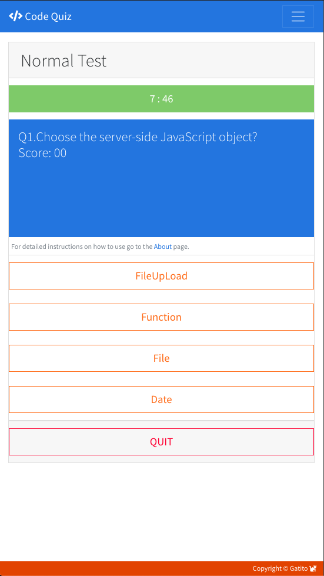

# 04 Web APIs: Code Quiz

Create an application that will present user with a Javascript multiple choice quiz, based on user-selected criteria in order to exercise key concepts like programing logic, flow control, division of concerns, array handling, local storage and dynamic object creation in DOM.

## 1. Guidelines

User Story and Acceptance Criteria were provided in the original `README.md` along with a GIF animation to provide a better sense of what was the target objective of the assignment. All of these inputs were taken into account when deciding the actual implementation route. Listed below is a review of these guidelines provided for the assignment.

### 1.1. Provided User Story.

AS A coding bootcamp student
I WANT to take a timed quiz on JavaScript fundamentals that stores high scores
SO THAT I can gauge my progress compared to my peers

### 1.2. Acceptance Criteria Checklist.

The following section takes the requirements provided in the homework assignment and we do a step by step crosscheck of each of the acceptance criterias while also providing feedback and comments.

#### 1.2.1 Initial Criteria.

* Build a timed code quiz with multiple-choice questions.
- [x] Done --- Issac.

* This app will run in the browser and feature dynamically updated HTML and CSS powered by your JavaScript code. It will also feature a clean and polished user interface and be responsive, ensuring that it adapts to multiple screen sizes.
- [x] Done --- Issac.

#### 1.2.2. Detailed Acceptance Criteria.

GIVEN I am taking a code quiz:

* WHEN I click the start button, THEN a timer starts and I am presented with a question.
- [x] After clicking the `START` button user is asked to register name and select difficulty level. Hard Mode = 5 min, Normal Mode = 8 min or Easy Mode = 10 min. After that quiz begins, 1st question is displayed and the timer begins to countdown.

* WHEN I answer a question, THEN I am presented with another question.
- [x] Quiz consists of 10 questions.

* WHEN I answer a question incorrectly, THEN time is subtracted from the clock.
- [x] if answered incorrectly the user gets penalized with 20, 30 or 40 seconds subtracted from the clock. Whenever a user is penalized a message is displayed in the UI.

* WHEN all questions are answered or the timer reaches 0, THEN the game is over.
- [x] User will get prompted halfway through, when 20 seconds are left, when 10 seconds are left and if time runs out. If time ran out user's score won't be submitted.

* WHEN the game is over, THEN I can save my initials and score.
- [x] Switched user registration to the beginning of the flow, since I think it's a better user experience and forces the user to register first thus avoiding any unregistered quizzes.

### 1.3. Deliverables.

* The URL of the deployed application.
- [x] https://carlosissac.github.io/mod04hwcodequiz/ --- Issac.

* The URL of the GitHub repository. Give the repository a unique name and include a README describing the project.
- [x] https://github.com/carlosissac/mod04hwcodequiz. Name of the repo is `mod04hwcodequiz`, a new `README.md` detailing the development process is also provided and displayed. --- Issac

## 2. Features and Comments.

The following section details the development decisions and implementation routes taken for this assignment.

## 2.1. UI Design.

* Everything was built from scratch.

* App has an `index.HTML` where the main quiz functionality is shown, a `scoreboard.HTML` where a score list is displayed and an `about.HTML` page where detailed instructions on how to use the app are provided and supporting links are included as well.

* `scoreboard.HTML` has 4 modes of displaying scores (ALL, Hard Mode only, Normal Mode only, Easy Mode only). Users can toggle between modes using the same button. Users can clear lists with subsequent buttons. User will be redirected to `scoreboard.HTML` after completing quiz.

* Positioning, Layout, text and design were all intentional.

* Navbar has functioning links, and a working Hamburger button.

* Brand button redirects to `index.HTML`.

* Image has an embedded live link to the artist's social media.

* Sticky footer was implemented.

* Additional styling fonts were successfully linked. The folloing URL was used https://use.fontawesome.com/releases/v5.10.1/css/all.css.

* The following bootstrap theme was successfully linked https://bootswatch.com/cosmo/.

* Below is an app snapshot detailing the main functionality screen.

## 2.3. HTML and CSS.

* Semantic HTML was used and Alt Tags were included in images.

* Each page has valid and correct HTML. In order to assure compliance the following validator was utilized: https://validator.w3.org/nu/. No errors are found in the final version.

* `style.CSS` file is available in the Assets folder and was successfully linked to both `index.HTML` and `about.HTML`.

* The site has working media queries that help with the padding configuration in smaller screen sizes.

* The following links were attached in order to assure hamburger button functionality.
   * https://code.jquery.com/jquery-3.4.1.slim.min.js.
   * https://stackpath.bootstrapcdn.com/bootstrap/4.4.1/js/bootstrap.bundle.min.js.
   * https://stackpath.bootstrapcdn.com/bootstrap/4.4.1/js/bootstrap.min.js.

## 2.4. JS code.

* Script files were provided inside the Assets folder.

* `quiz_script.js` has the main quiz UI functionality, `question_script.js` allocated a container housing all the available questions and a question handler method and object, `score_script.js` details all the scoreboard functionality.

* Object oriented design and basic functions were also whiteboarded before any coding actually took place.

* Modal elements were implemented in order to prompt messages and get user's input.

* Push and Pop methods were used in order to manipulate array buffers in question and score handler methods.

* Two timers were implemented. One at the beginning in order to countdown to start the test and a second one to track quiz time, this second one has different lengths depending on the quiz mode selected.

* Local storage functionality was used in order to store user score, JSON Stringify and Parse methods were also implemented in order to ensure correct object notation when retrieving data from local storage.

* Scoreboard lists are generated dynamically using Create Element method.

## 2.5. Pending Items.

* Navigation should be disabled when user is taking the quiz and enabled when the quiz is over, further research will be required on how to do this.

## 3. Conclusions.

Key takeaways from the assignment were first attempts at dynamic DOM manipulation by creating and appending elements, timer workflow synchronization, successful local storage implementation, adding Modal components to the UI, advanced array handling manipulation as well as expanding on previous JS knowledge. 

## 4. Appreciations.

* Maryus Martsyalis.
* Colin McPike.
* Beki Gonzales.
* Mark Kelly.
* Keith Billings.