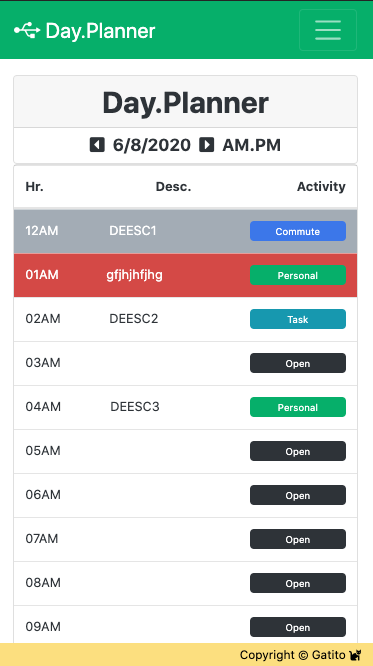

# 05 Third-Party APIs: Work Day Scheduler

Create an application that will present user with a calendar that will enable scheduling of events for each hour of the day, based on user-selected criteria in order to exercise dynamic object creation in the DOM, JQuery implementation, third party API usage and also expanding on key JS programming concepts.

## 1. Guidelines

User Story and Acceptance Criteria were provided in the original `README.md` along with a GIF animation to provide a better sense of what was the target objective of the assignment. All of these inputs were taken into account when deciding the actual implementation route. Listed below is a review of these guidelines provided for the assignment.

### 1.1. Provided User Story.

AS AN employee with a busy schedule
I WANT to add important events to a daily planner
SO THAT I can manage my time effectively

### 1.2. Acceptance Criteria Checklist.

The following section takes the requirements provided in the homework assignment and we do a step by step crosscheck of each of the acceptance criterias while also providing feedback and comments.

#### 1.2.1 Initial Criteria.

* This app will run in the browser and feature dynamically updated HTML and CSS powered by jQuery.
- [x] Done --- Issac.

* You'll need to use the [Moment.js](https://momentjs.com/) library to work with date and time.
- [x] Done --- Issac.

#### 1.2.2. Detailed Acceptance Criteria.

GIVEN I am using a daily planner to create a schedule:

* WHEN I open the planner, THEN the current day is displayed at the top of the calendar.
- [x] Current day is displayed, and current hour is autoscrolled on top, focus is also set on current hour.

* WHEN I scroll down, THEN I am presented with timeblocks for standard business hours.
- [x] I expanded this requirement for 24 hours.

* WHEN I view the timeblocks for that day, THEN each timeblock is color coded to indicate whether it is in the past, present, or future.
- [x] Expired time blocks (past), are color coded gray, Current time (present) is highlighted in red, Available time (future) is highlighted in white .

* WHEN I click into a timeblock, THEN I can enter an event.
- [x] When clicking on an available time slot with an Open tag user can submit a New Event. 
- [x] When selecting an available time slot with an previously assigned event, user can Edit or Delete the event. 
- [x] When clicking on an expired event (in current or past hours), user can only delete the event.

* WHEN I click the save button for that timeblock, THEN the text for that event is saved in local storage.
- [x] Local Storage handling functions were implemented.

* WHEN I refresh the page, THEN the saved events persist
- [x] closing the browser and refreshing the page, will load what is stored in Local storage.

### 1.3. Deliverables.

* The URL of the deployed application.
- [x] https://carlosissac.github.io/mod05hwdayplanner/ --- Issac.

* The URL of the GitHub repository. Give the repository a unique name and include a README describing the project.
- [x] https://github.com/carlosissac/mod05hwdayplanner. Name of the repo is `mod05hwdayplanner`, a new `README.md` detailing the development process is also provided and displayed. --- Issac

